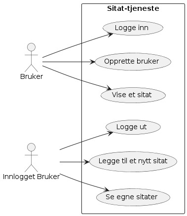

# Quote applikasjon

## Innledning

- Beskrivelse av formålet med webapplikasjonen og hva den skal oppnå.
- Oversikt over interessenter og brukerbehov.

## Kravspesifikasjon

- Detaljerte krav til funksjonalitet, brukergrensesnitt, ytelse, sikkerhet og andre aspekter.
- Prioritering av kravene og eventuelle avhengigheter.

## Design og arkitektur

- Beskrivelse av systemarkitekturen, inkludert komponenter, databaser og tjenester.
- Skisser eller wireframes av brukergrensesnittet.
- Teknologivalg og begrunnelser.
- Navnestandard (En beskrivelse av hvordan navn er bygget opp. Dette er standarder som skal sikre at navn er entydige og at alle forekomster bare har ett navn)
  Eksempel: navngiving JavaScript: variable: camel case (quoteOwner = "tsr"), konstanter: QUOTE_OWNER = "tsr";
  Mongo DB: hvordan blir navngi collections og documents?

ToDo: her kommer ip Plan, UseCase, Informasjonsmodell ++

### Informasjonsmodell

### UseCase

@startuml
left to right direction
actor "Bruker" as b
actor "Innlogget Bruker" as ib
rectangle Sitat-tjeneste{
usecase "Vise et sitat" as UC1
usecase "Opprette bruker" as UC6
usecase "Logge inn" as UC2
usecase "Se egne sitater" as UC3
usecase "Legge til et nytt sitat" as UC4
usecase "Logge ut" as UC5
}
b --> UC1
b --> UC2
b --> UC6
ib -->UC3
ib -->UC4
ib -->UC5
@enduml

## Utviklingsmetodikk

- Valg av utviklingsmetodikk (f.eks. Scrum, Kanban, Vannfall).
- Milepæler, sprinter og tidsplan.

### Prosjektplan med tidsestimater

| #   | Aktivitet                        | Timer | uke 19 | uke 20 | uke 21 | uke 22 | uke 23 | uke 24 |     |     |     |
| --- | -------------------------------- | ----- | ------ | ------ | ------ | ------ | ------ | ------ | --- | --- | --- |
| 1   | Installere og sette opp database | 5     | X      |        |        |        |        |        |     |     |     |
| 2   | Utvikle REST-API                 | 20    |        | x      | x      |        |        |        |     |     |     |
| 3   | Utvikle Websider                 | 20    |        |        | x      | x      |        |        |     |     |     |
| 4   | Utvikle tester                   | 10    | x      | x      | x      | x      |        |        |     |     |     |

## Implementasjon

- Beskrivelse av hvordan koden skal skrives og testes.
- Eventuelle tredjepartsbiblioteker eller rammeverk som skal brukes.

## Testing

- Plan for enhetstesting, integrasjonstesting og akseptansetesting.
- Kriterier for godkjennelse.

## Drift og vedlikehold

- Hvordan webapplikasjonen skal driftes og vedlikeholdes etter lansering.
- Backup-strategi, overvåking og feilretting.

kldsjf

## Brukerhistorie (UseCase) og sekvensdiagram

